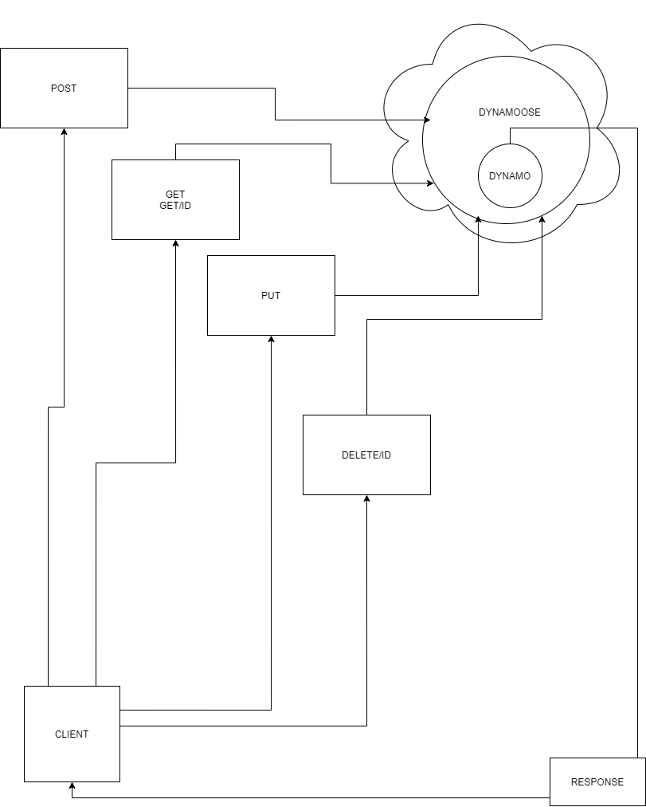

# lab 18 serverless-api

## Resources

Simon, Mariko, Stacy

[dynamoose docs](https://dynamoosejs.com/guide/Model)

[aws-sdk-mock](https://www.npmjs.com/package/aws-sdk-mock)

**What is the root URL to your API?**

[Root](https://boq1yie4pj.execute-api.us-west-2.amazonaws.com)

**What are the routes?**

[POST](https://boq1yie4pj.execute-api.us-west-2.amazonaws.com/mugs)
[GET](https://boq1yie4pj.execute-api.us-west-2.amazonaws.com/mugs/{id})
[PUT](https://boq1yie4pj.execute-api.us-west-2.amazonaws.com/mugs/{id})
[DELETE](https://boq1yie4pj.execute-api.us-west-2.amazonaws.com/mugs/{id})

**What inputs do they require?**

POST - REQUIRES KEYS; NAME, COLOR, DROPABLE, CAPACITY
GET - IF NO ID, RETURNS ALL. IF ID, RETURNS SINGLE OBJECT
PUT - UPDATE TO KEYS WITH ID
DELETE - ID TO DELETE

**What output do they return?**

POST - RETURNS STATUS CODE 200 AND SAVED RECORD OBJECT
GET - IF NO ID, RETURNS ALL. IF ID, RETURNS SINGLE OBJECT
PUT - UPDATED MODEL
DELETE - EMPTY OBJECT

## UML

